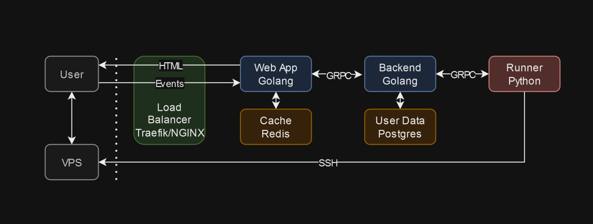

# EasyDeploy
easydeploy.ru

## Описание проекта

EasyDeploy — это решение для автоматизированного развертывания приложений на вашем собственном VPS. Наш продукт позволяет пользователям без технических навыков легко и быстро развертывать решения, используя минимальные усилия. 

## Основные возможности

- **Автоматическое развертывание**: Позволяет пользователям развертывать приложения на своих серверах без необходимости в глубоких технических знаниях.
- **Поддержка различных решений**: Вы можете выбрать из множества доступных решений, которые подходят именно вам.
- **Мониторинг и управление**: Встроенные инструменты для мониторинга и управления развернутыми приложениями.

## Использование

### https://easydeploy.ru 

## Локальная установка и настройка

1. Клонируйте репозиторий:
   ```bash
   git clone <URL вашего репозитория>
   ```

2. Перейдите в директорию проекта:
   ```bash
   cd easydeploy
   ```

3. Установите нужные конфиги
   ```bash
   cd backend
   mv .env.dist .env
   ```

   ```bash
   cd runner
   mv .env_example .env
   ```


4. Запустите приложение с помощью Docker Compose:
   ```bash
   docker-compose up -d --build
   ```

Эта команда создаст и запустит контейнеры в фоновом режиме, используя конфигурацию из файла `docker-compose.yml`.


## API

Наш API предоставляет следующие возможности:

- **Создание задачи на деплой**: Позволяет создавать задачи для развертывания приложений на сервере.
  - **Метод**: POST
  - **Путь**: `/solution/v1/deploy`
  - **Описание**: Создание задачи на деплой.
  - **Параметры**: 
    - `solution_id`: ID решения для развертывания (берутся из файла playbooks, id 1 и 2 соотвественно).
    - `ssh_address`: Адрес SSH для подключения.
    - `ssh_key`: Ключ SSH для аутентификации.
    - `extra_vars`: Дополнительные переменные для настройки.

- **Получение статуса деплоя**: Позволяет отслеживать статус развертывания.
  - **Метод**: GET
  - **Путь**: `/solution/v1/get_status`
  - **Описание**: Получение статуса деплоя.
  - **Параметры**: 
    - `id`: ID задачи для получения статуса.

- **Получение доступных решений**: Позволяет получить список доступных для развертывания решений.
  - **Метод**: GET
  - **Путь**: `/solution/v1/list`
  - **Описание**: Получение доступных решений.

## Архитектура

EasyDeploy построен на современной архитектуре, которая обеспечивает гибкость, масштабируемость и высокую производительность. Основные компоненты системы включают:



1. **Веб-интерфейс (WebApp на Go)**:
   - **Реализация**: Написан на языке Go, обеспечивает высокую производительность и низкое потребление ресурсов.
   - **Функциональность**: Предоставляет пользователям удобный интерфейс для взаимодействия с системой через браузер.
   - **Плюсы**:
     - Высокая скорость работы благодаря компиляции Go.
     - Простота развертывания и поддержки.

2. **API Gateway (Traefik)**:
   - **Реализация**: Использует Traefik для маршрутизации HTTP и gRPC запросов.
   - **Функциональность**: Управляет балансировкой нагрузки.
   - **Плюсы**:
     - Автоматическое обновление конфигурации при изменении сервисов.
     - Поддержка динамической маршрутизации и SSL.

3. **gRPC сервер**:
   - **Реализация**: Обрабатывает запросы от API Gateway и других клиентов.
   - **Функциональность**: Реализует высокопроизводительные gRPC-сервисы для управления процессами развертывания.
   - **Плюсы**:
     - Высокая производительность и низкая задержка.

4. **Сервис развертывания**:
   - **Реализация**: Использует SSH и Ansible для автоматизации развертывания приложений на удаленных серверах.
   - **Функциональность**: Выполняет задачи развертывания, подключаясь к серверам.
   - **Плюсы**:
     - Автоматизация сложных процессов развертывания.
     - Поддержка различных конфигураций серверов.

5. **База данных (PostgreSQL)**:
   - **Реализация**: Использует PostgreSQL для хранения данных.
   - **Функциональность**: Хранит информацию о пользователях, задачах развертывания и доступных решениях.
   - **Плюсы**:
     - Надежное хранение данных и поддержка транзакций.
     - Масштабируемость и поддержка сложных запросов.

6. **Мониторинг и логирование**:
   - **Реализация**: Включает инструменты для отслеживания состояния системы и логирования событий.
   - **Функциональность**: Позволяет администраторам анализировать производительность системы.
   - **Плюсы**:
     - Возможность быстрого обнаружения и устранения проблем.
     - Поддержка интеграции с различными системами мониторинга.

Эта архитектура обеспечивает надежное и эффективное развертывание приложений, минимизируя необходимость в технических знаниях со стороны пользователей, и поддерживает высокую производительность.


---
